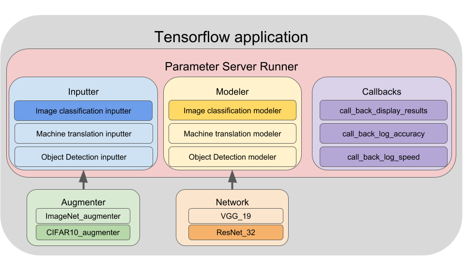

Getting Started
========================================

Welcome to Lambda Lab's deep learning demo suite -- the place to find ready-to-use machine learnig models. We offer the following cool features:

* A curate of open-source, state-of-the-art models that cover major machine learning applications, including image classification, image segmentation, object detection etc.

* Pure Tensorflow implementation. Efforts are made to keep the boilplate consistent across all demos.

* Examples of transfer learning and how to adapt the model to new data.

In this getting started guide, we will walk you through the glossary of our code and the steps of building tensorflow applications.  

* :ref:`glossary`
* :ref:`example`

.. _glossary:

Glossary
--------------------------------------

Our TensorFlow application is comprised of three main components:

* **Inputter**: The data pipeline. It reads data from the disk, shuffles and preprocesses the data, creates batches, and does prefetching. An inputter is applicable to a specific problem that share the same type of input and output. For example, we have image_classification_inputter, machine_translation_inputter, object_detection_inputter ... etc. An inputter can optionally own an **augmenter** for data augmentation, for example, random scale and crop, color distortion ... etc.

* **Modeler**: The model pipeline. The Modeler encapsulates the forward pass and the computation of loss, gradient, and accuracy. Like the inputter, a modeler is applicable to a specific problem such as image classification or object detection. A modeler must own a **network** member that implements the network architecture, for example, an image classification modeler can have ResNet32, VGG19 or InceptionV4 as its network architecture.

* **Runner**: The job executor. It orchestrates the execution of an Inputter and a Modeler and distributes the workload across multiple hardware devices. It also uses **callbacks** to perform auxiliary tasks such as logging, model saving and result visualization.

:numref:`tensorflow-application` illustrates the composition of a tensorflow application using these building blocks.

.. _example:

Example: Training a ResNet32 newtowrk on CIFAR10 
---------------------------------------------------

Let's walk through an example of building a Tensorflow application. In this example we will use a ResNet32 model for classifying CIFAR10 images.

Before diving into details, here is all the code for this guide. It gives an overview of the boilplate we use to build Tensorflow applications. 

.. code-block:: python

  # Create basic inputter configration
  inputter_config = InputterConfig(
    mode="train",
    batch_size_per_gpu=64,
    gpu_count=1,    
    epochs=4,
    dataset_meta="~/demo/data/cifar10/train.csv \")

  # Add additional configuration for image classification
  inputter_config = ImageClassificationInputterConfig(
    inputter_config,
    image_height=32,
    image_width=32,
    image_depth=3,
    num_classes=10)

  # (Optionally) Create a augmenter.
  argmenter_name = "source.augmenter.cifar_augmenter"
  augmenter = importlib.import_module(argmenter_name)

  # Create a Inputter.
  inputter_name = "source.inputter.image_classification_csv_inputter"
  inputter = importlib.import_module(inputter_name).build(inputter_config, augmenter)

  # Create a ResNet32 network
  network_name = "source.network.resnet32"
  net = getattr(importlib.import_module(network_name), "net")

  # Create basic modeler configration
  modeler_config = ModelerConfig(
    mode="train",
    batch_size_per_gpu=64,
    gpu_count=1,    
    optimizer="momentum",
    learning_rate=0.01)

  # Add additional configuration for image classification
  modeler_config = ImageClassificationModelerConfig(
    modeler_config,
    num_classes=10)  

  # Create modeler
  modeler_name = "source.modeler.image_classification_modeler"
  modeler = importlib.import_module(modeler_name).build(modeler_config, net)

    # Create callback configuations
  callback_config = CallbackConfig(
    mode="train",
    batch_size_per_gpu=64,
    gpu_count=1,    
    model_dir="~/demo/model/image_classification_cifar10",
    log_every_n_iter=10,
    save_summary_steps=10)

  # Create callbacks
  callback_names = ["train_basic", "train_loss", "train_accuracy",
                    "train_speed", "train_summary"]
  callbacks = []
  for name in callback_names:
	callback = importlib.import_module(
	  "source.callback." + name).build(callback_config)
	callbacks.append(callback)

  # Create run config
  runner_config = RunnerConfig(
    mode="train",
    batch_size_per_gpu=64,
    gpu_count=1,    
    summary_names=["loss,accuracy", "learning_rate"])

  # Create a runner
  runner_name = "source.runner.parameter_server_runner"
  runner = importlib.import_module(runner_name).build(runner_config, inputter, modeler, callbacks)

  # Run the application
  runner.run()

You can find details for each step in the follows chapters:

.. toctree::
   :maxdepth: 2

   define_inputter
   define_modeler
   define_runner
